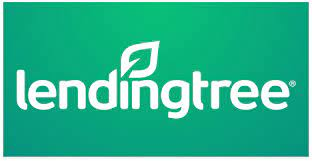
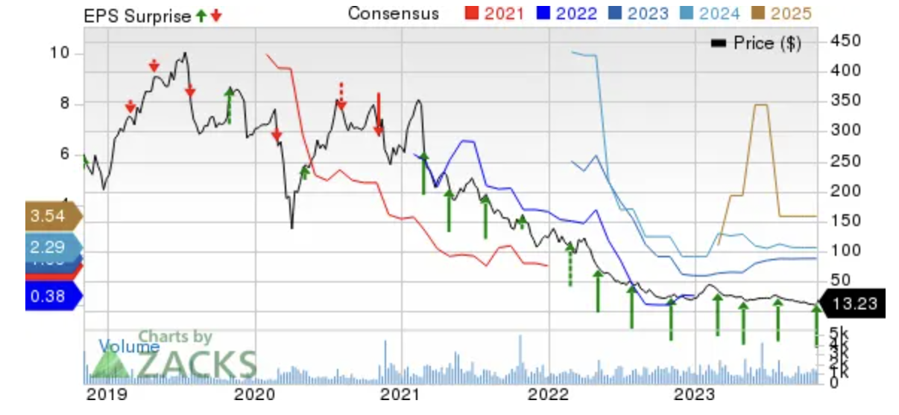

# Module 1 Challenge: LendingTree Case Study

## Overview and Origin

### LendingTree Inc.

LendingTree was incorporated on June 7, 1996 in Delaware. Nationwide operations were later launched on July 1, 1998. LendingTree headquarters is now located in Charlotte, North Carolina.

**Founder:** Douglas Lebda (CEO).

The idea for LendingTree dawned on Doug Lebda when he first experienced his own problems and frustrations applying for a mortgage. He envisioned a simplified way to shop for loans. Instead of visiting various banks in person, the customer could easily and conveniently access this information online - leading to the development of LendingTree.

LendingTree has had 3 successful funding rounds. In it's latest funding round (post IPO), LendingTree raised $500M (July 21, 2020). In the previous 2 rounds, LendingTree raised $350M in Oct 2018 and $300M in Dec 2017. Total funding raised to date equates to $1.15 billion. 

## Business Activities

LendingTree sucessfully alleviates various financial problems that consumers commonly face when seeking loans or other financial products. This includes limited access to loan options - including mortgages, home equity loans, auto, personal, student, and business loans. It also improves convenience and time savings with comparison models, and ease in finding best terms. LendingTree provides a convenient platform that connects consumers to lenders from a network of over 500 partners to compare and choose the best option that best suits their financial needs - all in one place. 

The intended customer of LendingTree is any consumer residing in the USA looking for a convenient and simplified way to find and compare loan options. LendingTree has helped over 110 million consumers secure a loan, with 15 million current active users. 

LendingTree differentiates itself from competitors with a number of beneficial features. Oppose to offering loans directly, it acts as a marketplace with a network of over 500 partners to find and compare loan terms that best fits the consumers needs. It also offers a broad range of financial prodcuts, versus offering one product such as mortgages or peer to peer lending. It  offers educatinal resources to guide decision making and financial choices, as well as provides users with credit scores and reports. Above all, it's convenience and comparison capabilities allows it to stand out from competitors.  

LendingTree uses a variety of technologies including but not limited to JavaScript, HTML5, Amazon EC2 and RDS, SQL, Google Analytics, AI and Machine Learning, Git, GitHub, and Visual Studio Code. It uses these applications to create interactive web content, manage and improve user experience, use secure compute capacity in the cloud, analyze statistics, and so on. 

## Landscape

### Fintech Domain: Lending

**Trends and innovations emerging in lending over the past 5-10 years:**

1. Digital Transformation
    * Online and mobile lending platforms
2. Decentralized Lending: Blockchain and Smart Contracts
    * Peer-to-peer lending platforms
3. Nonbank lenders continue to grow market share
4. Companies are bundling home-buying services, including mortgages
5. Nonqualified mortgage lenders are reentering the market

Banks acquire most of the market share, while companies such as LendingTree, Rocket Mortgage, and LoanDepot own a small percentage. Major companies in this domain (in the US, given LendingTree is a US company) include: 
> Rocket Mortgage, United Shore Financial, LoanDepot, Bankrate, Wells Fargo, Fairway Independent Mortgage, Bank of America, U.S. Bank, JP Morgan Chase, PNC Bank, Citizens Bank, SoFi, NerdWallet, and Capital One. 

## Results

**Business Impact:** LendingTree has diversified loan offerings and improved the consumer experience.  

**Core metrics used by lending companies to measure success include:**
1. Pull through rate
2. Loan approval rate
3. Application approval rate
4. Abandoned loan rate
5. Average cycle time 
6. Average origination value

Given the increase in interest rates and persistent inflation, mortgage loans have decreased across the board. Consumer demand for loans and insurance needs however remain high, but tightened  financial conditions pressure LendingTree's partners to meet the demand. Most competitors have experienced a revenue decrease in the last quarter, as noted by [CSI Market](https://csimarket.com/stocks/compet_glance.php?code=TREE) "LendingTree Inc. reported revenue decrease in the 3rd quarter 2023 year on year by -34.75 %, faster than the overall decrease of LendingTree Inc.'s competitors by -2.53 %, recorded in the same quarter." LendingTree has responded by working to drive efficiencies to improve margins, reduce expenses, and narrow growth initiatives. 

[LendingTree Inc. Price, Consensus and EPS Surprise](https://nz.finance.yahoo.com/news/lendingtree-tree-stock-rises-19-164100069.html):

## Recommendations

An opportunity for growth within LendingTree includes enhancing their insurance comparison and purchasing function. While LendingTree already offers some insurance products, it could expand its insurance services to include a broader range of coverage types. This might involve allowing users to compare and purchase various insurance policies, such as life insurance, health insurance, property insurance, travel insurance, or liability insurance. 

Offering a wider array of insurance products can diversify revenue streams, increase cross-selling opportunities, and allow for bundled products - further giving the company a competitive advantage. 

LendingTree likely already uses many of the required technoliges needed to diversify their insurance product offerings. These include technologies such as HTML and Javascript, SQL, cloud services, AI and Machine Learning, APIs, and data analytics such as Google Analytics.

These techonologies are necessary for the development of webpages and mobile apps, cloud services to host and scale applications and data, and AI for risk assessment and personalized recommendations for the user. 

## Citations
* [Incorporation date & founder](https://www.sec.gov/Archives/edgar/data/1096479/000095014402009364/g78146sv8.htm#:~:text=through%20such%20exchanges.-,LendingTree%2C%20Inc.,(704)%20541%2D5351.&text=An%20investment%20in%20our%20common%20stock%20involves%20a%20high%20degree%20of%20risk)
* [About founder & how the company started](https://press.lendingtree.com/about/our-executives/bio/douglebda)
* [Funding](https://tracxn.com/d/companies/lendingtree/__769cmFoK_kfFXSkqH-du-uY2RTSSV-E5NCIaloBvu-0/funding-and-investors)
* [LendingTree FAQ for business activities section](https://www.lendingtree.com/about/faq/#:~:text=How%20does%20LendingTree%20work%3F,for%20your%20business%2C%20you%20win!)
* [User/Consumer data](https://www.cloudflare.com/case-studies/lendingtree/)
* [Investopedia for business activities section](https://www.investopedia.com/articles/personal-finance/110915/how-lendingtree-mortgage-works.asp)
* [Technologies used by LendingTree (Stack Share)](https://stackshare.io/lendingtree/lendingtree)
* [Major mortgage lending companies](https://www.forbes.com/advisor/mortgages/10-largest-mortgage-lenders-in-us/)
* [Major lending companies](https://www.crunchbase.com/hub/united-states-lending-companies)
* [Metrics](https://www.lightico.com/blog/lending-kpis-most-important/)
* [Metrics 2](https://www.linkedin.com/pulse/top-10-kpis-measure-efficiency-loan-origination-mani-parthasarathy/)
* [Letter to Shareholder](https://investors.lendingtree.com/static-files/a437a704-fb2b-4636-8ba9-b3506f8d70c2)
* [Cross-Selling](https://business.linkedin.com/sales-solutions/resources/sales-terms/cross-selling)
* [Technology predictions](https://www.crunchbase.com/organization/lendingtree/technology)
* [Trends & Innovations](https://www.mckinsey.com/industries/private-equity-and-principal-investors/our-insights/five-trends-reshaping-the-us-home-mortgage-industry)
* [Trends & Innovations 2](https://medium.com/blockchain-breeze/decentralized-lending-revolutionizing-finance-through-blockchain-and-smart-contracts-61361208f58e)

